# BSSE Image Editor

A 24-bit BMP image editor built in C, using the [IUP](https://www.tecgraf.puc-rio.br/iup/) toolkit for the GUI. Built as a final project for BSSE 1849.

## Features

- **Open** — load any 24-bit BMP image (rejects other formats with an error popup instead of crashing)
- **Apply Grayscale** — convert the image to grayscale
- **Brightness Adjustment** — increase/decrease brightness by a user-specified offset
- **Invert selected image** — invert all pixel colors
- **Flip Horizontally / Flip Vertically**
- **Rotate image by 90 degrees**
- **Crop image** — crop to a user-specified X, Y, Width, and Height
- **Blur image** — box blur convolution
- **Increase Sharpness of the image** — sharpening convolution kernel
- **Undo last change** — step back through edit history
- **Save image** — write the current edited image out to a new BMP file, with a user-specified filename

Every editing operation keeps a history so **Undo** can step back to any previous state.

## How to Compile

Requires the IUP library installed on your system.

```bash
gcc BSSE_1849_Final_Project.c -liup -o image_editor.out
./image_editor.out
```

Tested on Ubuntu with IUP 3.32.

## How to Use

1. Run the program — an empty editor window opens.
2. Click **Open image** and select a 24-bit BMP file.
3. Use the buttons on the right panel to apply edits. Some operations (Brightness, Crop, Save) will pop up a small dialog asking for parameters.
4. Click **Undo last change** to revert the most recent edit.
5. Click **Save image** and enter a filename to save your result.

## Screenshots

**Main editor window**
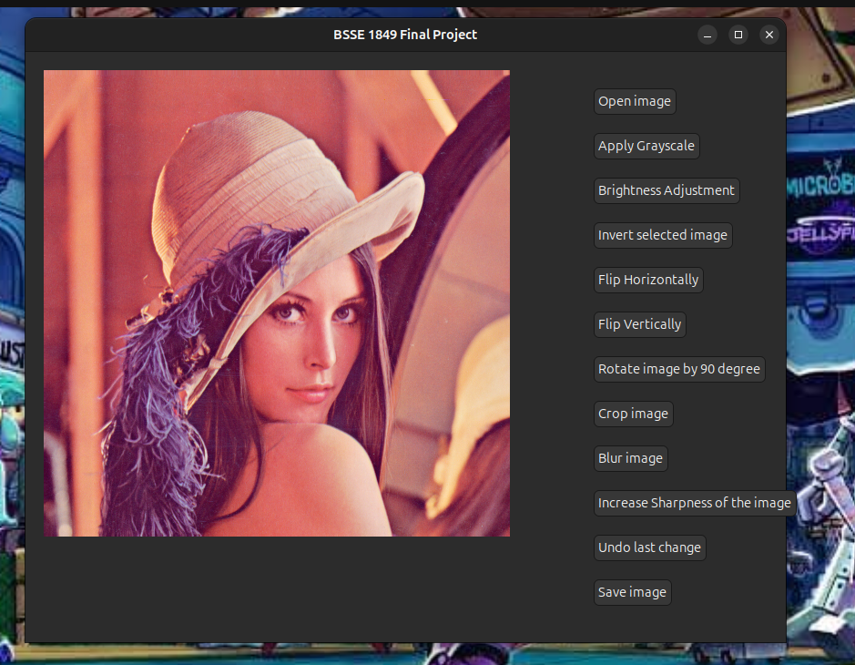

**Apply Grayscale**
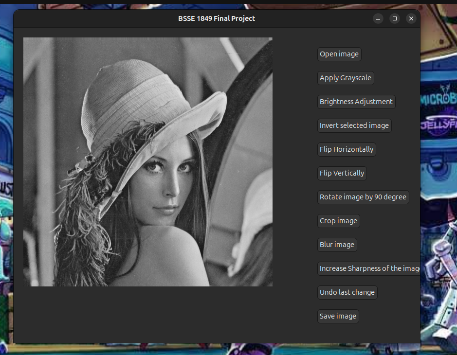

**Brightness Adjustment dialog**
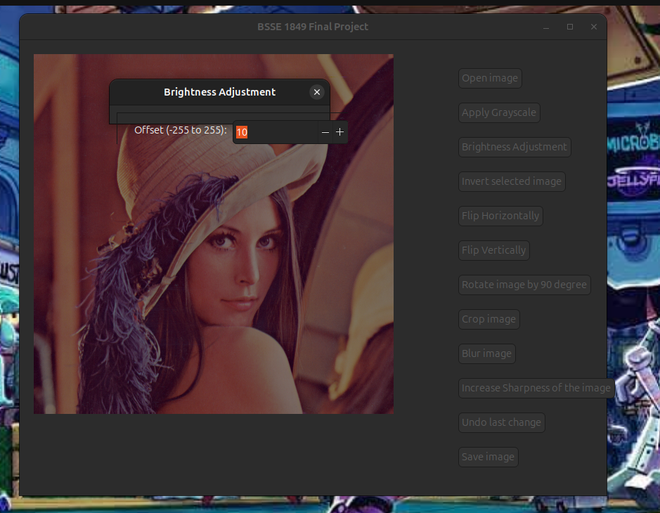

**Brightness applied**
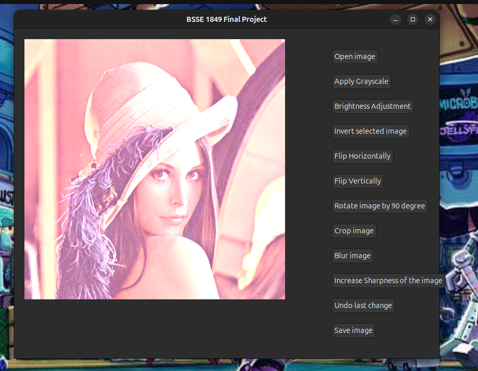

**Invert selected image**
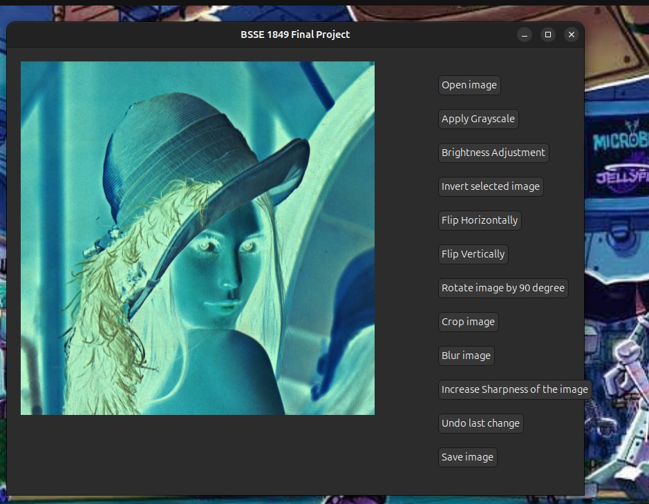

**Flip Horizontally**
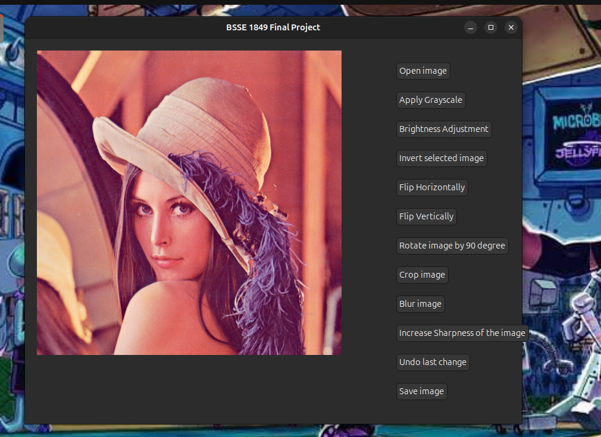

**Flip Vertically**
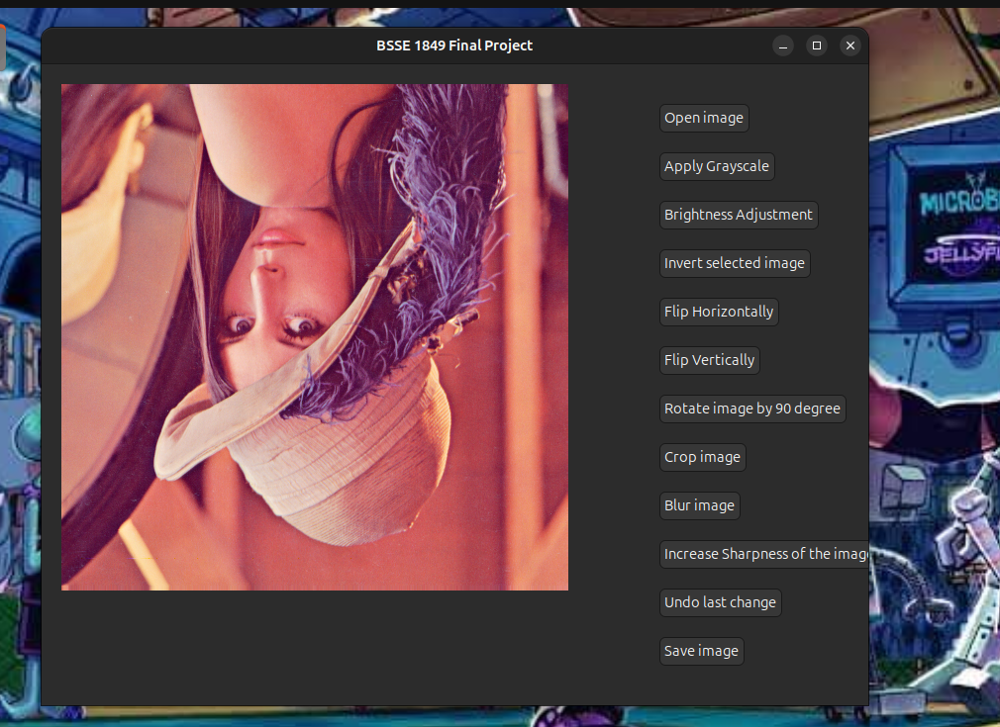

**Rotate image by 90 degrees**
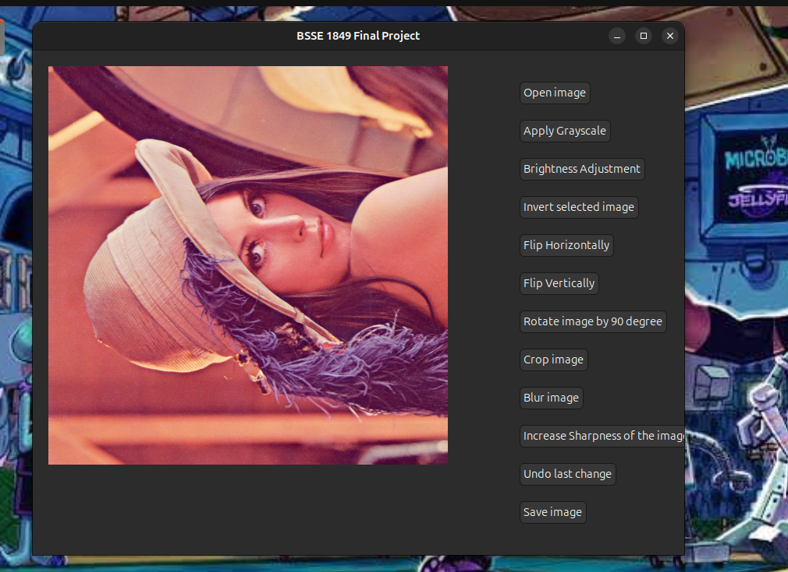

**Crop image**
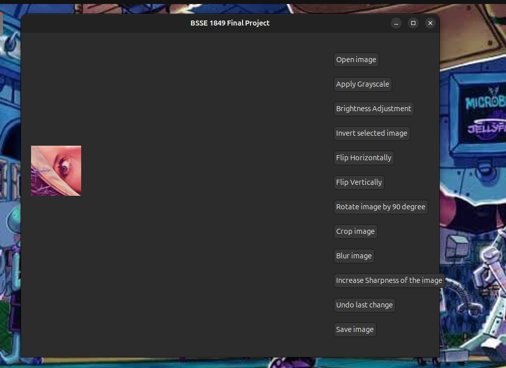

**Undo last change**
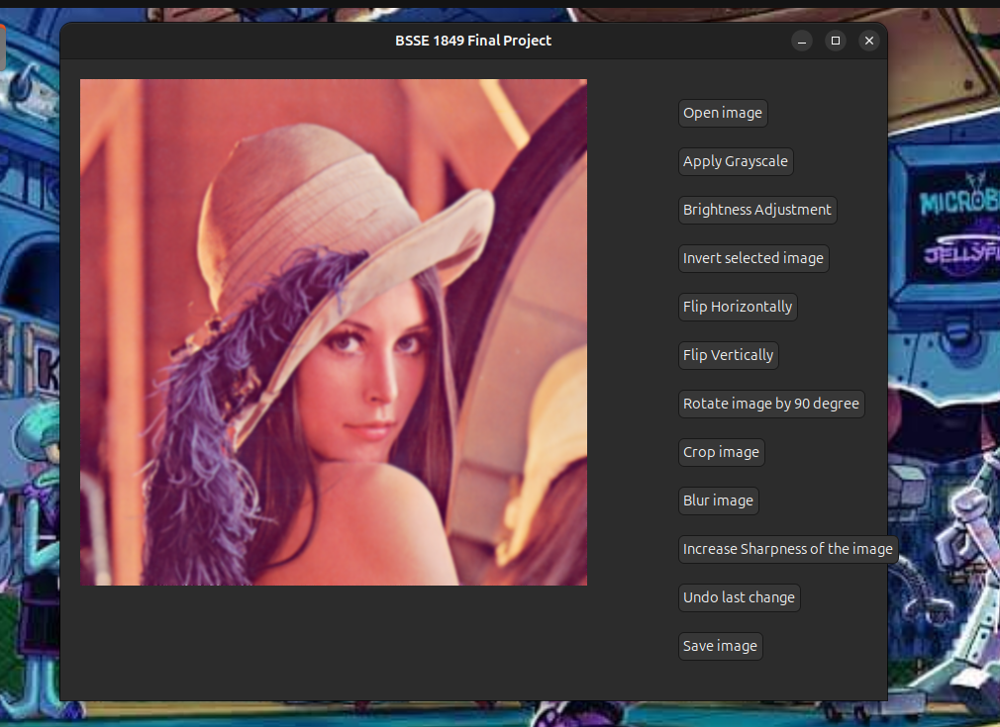

**Increase Sharpness of the image**
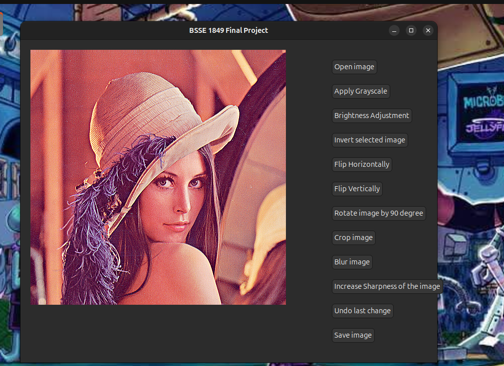

**Save image dialog**
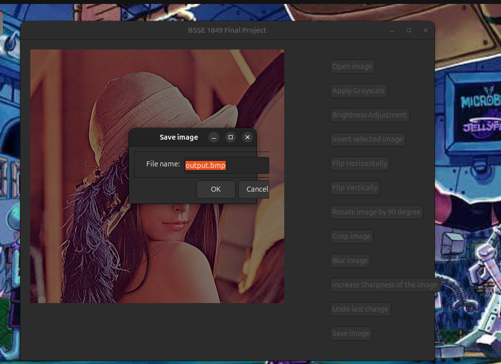

**Error handling for invalid file**
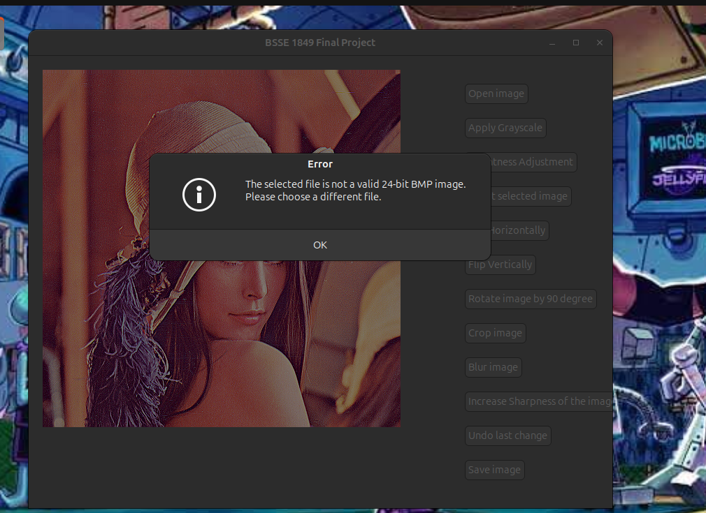

## Known Limitations

- Save currently writes a full row of pixel data without re-adding BMP row padding for widths not divisible by 4 — works correctly for image widths where `width * 3` is already a multiple of 4.
- Crop does not currently validate that the requested rectangle fits inside the image bounds.

## Author

Shahariar Nafis — BSSE 1849
